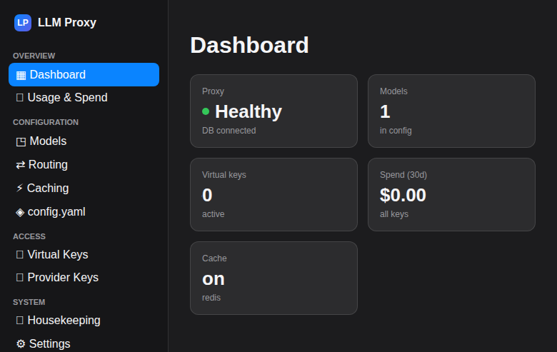
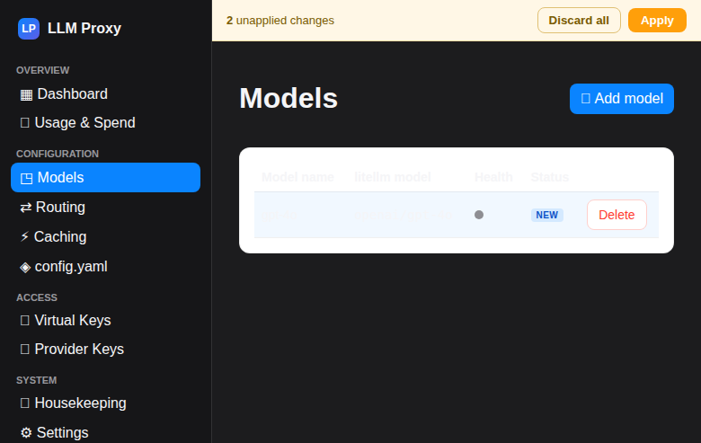
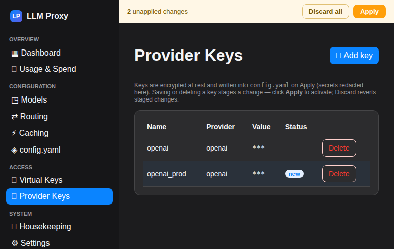
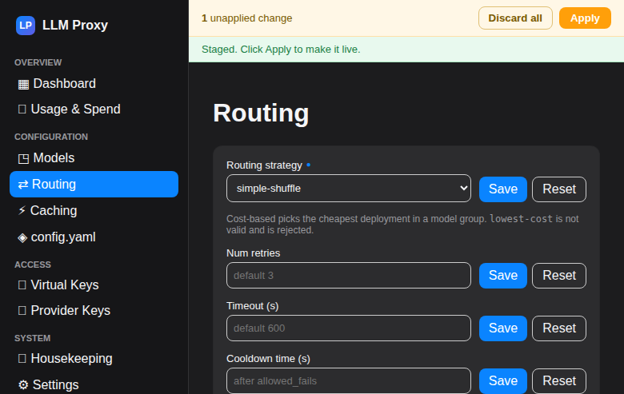
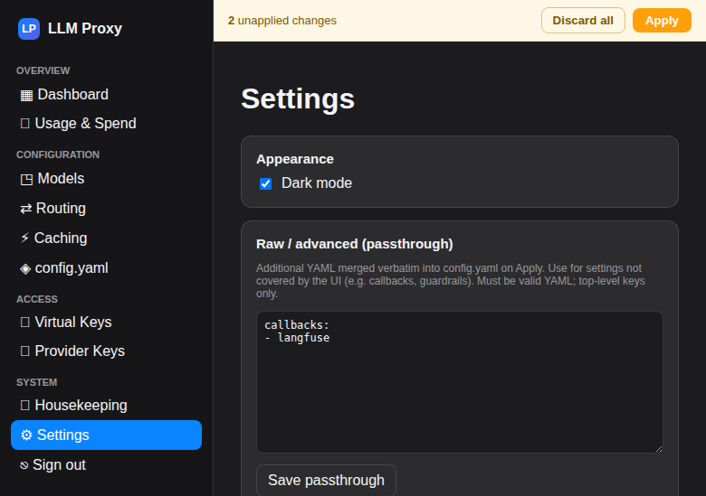
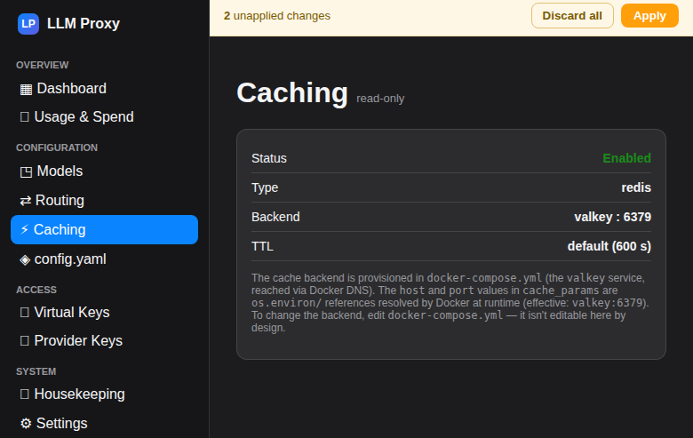
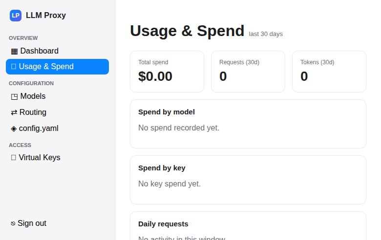

# LLM-Proxy

A self-hosted **[LiteLLM](https://github.com/BerriAI/litellm) gateway** (Docker
Compose) — LiteLLM proxy + Postgres + Valkey — with a **purpose-built, Apple-HIG
admin UI** that replaces LiteLLM's bundled UI. All proxy configuration is owned by
the UI's database (the Master); LiteLLM is the Servant that executes whatever the
Master dispatches via a rendered `config.yaml`.

> **Status: v3 — Master/Servant config redesign.** The admin UI (`llm-proxy-ui`) is
> complete through **v3**: a **DB-authoritative, staged-item config model** (Master =
> UI + Postgres; Servant = LiteLLM), a per-item **Save → Apply / Discard** workflow,
> encrypted-in-DB credentials, a **passthrough** editor for advanced keys, and a
> **rendered-config preview**. Released via CI to GHCR. See
> **[`docs/admin-ui.md`](docs/admin-ui.md)** and the
> [v3 design spec](docs/superpowers/specs/2026-06-08-llm-proxy-ui-v3-master-servant-config.md).

## The admin UI



| | |
|---|---|
|  |  |
|  |  |
|  |  |

Shown in dark mode (a light theme is included too). The amber **Apply** bar (top)
appears whenever there are DB-backed staged changes — one Apply renders → validates →
writes `config.yaml` → restarts the proxy → verifies health.

**Screens:** Dashboard (KPI cards) · Usage & Spend · Models (catalog-driven provider
picker, credential dropdown, CRUD + test/health/costs) · Provider Keys (encrypted
in DB; staged items) · Routing (strategy, timeout/cooldown, fallbacks) · Caching
(read-only status) · Rendered config preview (secrets redacted) · Virtual Keys
(create/budget/delete) · DB Housekeeping · Settings (passthrough/advanced YAML
editor, catalog sync, dark mode).

Each config screen's **Save** stages an item into the DB (no restart, no file
write). The global **Apply** bar renders all staged items → validates → writes the
`config.yaml` → restarts the proxy once → verifies health and `/v1/models`. A failed
restart is reported, not rolled back — the DB and file stay consistent; fix forward.

## Why a custom UI — and how v3 works

LiteLLM's bundled UI was unreliable on this stack, so the guardrails are baked into
the design:

- It **never writes an `ssl` key** into `cache_params` → LiteLLM bug #10949 (SSL
  handshake hangs against plain Valkey) is impossible.
- `routing_strategy` is constrained to the valid enum (the bogus `lowest-cost` is
  rejected). Model/general secrets must be `os.environ/<VAR>` references — the one
  exception is the **credential vault**, which is the UI's job.

### The v3 Master/Servant model

- **Master = the UI app + its Postgres DB.** The DB owns *intent* — the desired
  configuration. It is the single source of truth.
- **Servant = LiteLLM.** It owns *execution* — it runs whatever the Master
  dispatches. It stays in config-only mode (`store_model_in_db: false`).
- **`config.yaml` is a rendered artifact**, not a source of truth. The Master renders
  and writes it on every Apply; a hand-edit is overwritten on the next Apply.

**Staged item model:** every config value is an *item* (kind + name + data) stored
in two DB tables: `ui_config_applied` (last-applied = what `config.yaml` holds) and
`ui_config_staged` (pending, flagged `new` / `changed` / `deleted`). Editing any
screen stages an item — no file write, no restart. The UI shows each item's flag in
an accent color; `deleted` items show struck-through until Apply or Discard.

**Apply** is the commit boundary:
1. Render the effective items → validate (guardrails + schema). Invalid → 422,
   nothing written, staged intact.
2. Write to a temp file, read-back to confirm bytes on disk. Disk error → 500,
   nothing folded, staged intact.
3. `os.replace` temp → `config.yaml` (0600); fold staged into applied; clear staged.
   The invariant holds: `config.yaml == render(applied)`.
4. Restart the Servant; verify health + `/v1/models`. Result is *reported*, never
   rolled back. A failed-but-valid config is fixed forward via the UI.

**Discard** clears staged items (no file write, no restart). Pending state survives
logout/restart because it is DB-backed.

**Credentials** are staged items too — encrypted at rest (Fernet) in the DB,
shown `***` everywhere in the UI and API. Only the rendered `config.yaml` (0600,
gitignored) holds the materialized literal for the Servant.

**Passthrough:** a raw-YAML editor (Settings screen, DB-stored) for advanced LiteLLM
keys the UI doesn't model. Merged into the render at Apply; managed sections win.
YAML-validated before staging so a bad free-form key is caught before it can crash
the Servant.

## Stack

| Service | Image | Purpose |
|---|---|---|
| `litellm` | `ghcr.io/berriai/litellm:main-stable` | OpenAI-compatible gateway (config-only; bundled UI not used) |
| `llm-proxy-ui` | `ghcr.io/tekgnosis-net/llm-proxy-ui` | Apple-HIG admin UI (FastAPI + Svelte) |
| `postgres` | `postgres:16-alpine` | Virtual keys, budgets, spend logs, and **UI config staging tables** |
| `valkey` | `valkey/valkey:8-alpine` | Response cache + rate-limit state (Redis-protocol, BSD-3 fork) |
| `socket-proxy` | `tecnativa/docker-socket-proxy` | Scoped Docker access so the UI can restart the proxy to apply config |

**Configuration model:** the Postgres DB (via the UI) is authoritative for models,
routing, caching, and credentials. Keys/budgets/spend are stateful and live in
Postgres, managed via the proxy API. See
[`docs/config-schema.md`](docs/config-schema.md) for the full set of config
parameters the UI generates and validates.

## Quickstart

No build step — the images are pulled (the UI image is published publicly to GHCR).

```bash
# 1. configure secrets interactively — creates/updates .env with everything
#    docker-compose.yml needs (auto-generates keys, hashes + escapes the admin
#    password, etc.). Re-run any time to change values.
./setup_env_helper.sh

# 2. start the stack (pulls the published images)
docker compose up -d        # wait for (healthy)
```

Open the **admin UI** at `http://<host>:${UI_PORT:-8081}` and log in with your
password. Proxy health: `curl -fsS http://localhost:4000/health/readiness`.

> Prefer to set `.env` by hand? Copy `.env.example` to `.env` and fill it in —
> note the admin hash's `$` must be escaped as `$$` (the helper does this for you).
> The UI image is **pinned** to a release tag in `docker-compose.yml`; to update,
> bump that tag to a newer release (or switch it to `:latest` for auto-updates),
> then `docker compose pull && docker compose up -d`.

## Bind-mounted layout

```
.
├── docker-compose.yml
├── .env                 ← secrets (NOT in git)
├── config/config.yaml.example  ← secret-free bootstrap (committed; seeds first-run import)
├── config/config.yaml   ← rendered artifact (UI writes on Apply; 0600, git-ignored; do NOT treat as source of truth)
├── ui/                  ← the custom admin UI (FastAPI + Svelte)
└── data/{postgres,valkey}/  ← persistent state
```

`config/config.yaml` is a **rendered artifact** — the Master writes it on every
Apply from the DB. Do not hand-edit it expecting changes to persist; the next Apply
overwrites it. To change config, use the UI (which stages an item) then Apply. The
file is written mode **`0600`** and is **git-ignored** because it holds materialized
credential secrets. The repo commits `config/config.yaml.example` (secret-free) as
the bootstrap seed.

### v2 → v3 migration (first boot)

On the first v3 boot, if the DB config tables are empty, the UI **imports** the
existing `config.yaml` automatically: managed sections (`model_list`,
`router_settings`, `litellm_settings`, `general_settings`, `credential_list`) are
split into typed items; everything else goes to the passthrough item; any literal
`credential_list` secrets are encrypted into credential items. After import the DB
is authoritative — `config.yaml` is not re-read. If upgrading from v2, the old
`ui_credentials` table is migrated into credential items and dropped. The import is
idempotent (guarded by an applied-table-empty check).

## Secrets in `.env`

- **`LITELLM_MASTER_KEY`** — gates the proxy's admin API; the UI holds it
  **server-side only**, never sent to the browser. Safe to rotate.
- **`LITELLM_SALT_KEY`** — encrypts provider API keys in Postgres. **Do not
  rotate** after adding keys (makes them undecryptable). Back it up.
- **`ADMIN_PASSWORD_HASH`** (argon2), **`SESSION_SECRET`** — admin UI login +
  cookie signing. The hash's `$` must be escaped as `$$` in `.env` (see
  [`docs/admin-ui.md`](docs/admin-ui.md)). **`SESSION_SECRET` also derives the
  credential vault's encryption key — don't rotate it after saving credentials**
  (makes them undecryptable), or set a dedicated `CREDENTIALS_KEY`.

`.env` is `.gitignore`d — share `.env.example` only.

## DB housekeeping (optional)

Set in `.env` to enable the scheduled maintenance cron (off by default):

```bash
HOUSEKEEPING_ENABLED=true
HOUSEKEEPING_INTERVAL_HOURS=24
HOUSEKEEPING_SPENDLOG_RETENTION_DAYS=90
```

The Housekeeping screen shows DB size/row counts and a manual "Run now" (trims
spend logs past retention + deletes expired keys; bounded + parameterized).

## Common operations

```bash
docker compose logs -f litellm                 # tail proxy logs
docker compose restart litellm                 # restart proxy (Apply does this automatically)
docker compose down                            # stop (data persists in ./data)
docker compose exec postgres pg_dump -U "$POSTGRES_USER" litellm > backup-$(date +%F).sql
```

If Postgres shows permission errors on first boot:
`sudo chown -R 999:999 data/postgres data/valkey` then `docker compose up -d`.

## Documentation

- **[`docs/admin-ui.md`](docs/admin-ui.md)** — the admin UI (architecture, run, features).
- **[`docs/config-schema.md`](docs/config-schema.md)** — LiteLLM config.yaml parameter reference.
- **[`docs/superpowers/specs/`](docs/superpowers/specs/)** — design specs (v1, v2, v3).
- **[`docs/superpowers/plans/`](docs/superpowers/plans/)** — per-phase implementation plans.
- **[`docs/archive/`](docs/archive/)** — legacy guides for the bundled LiteLLM UI (concepts still valid).

## CI/CD

`main` runs **semantic-release** (conventional commits → versioned GitHub
releases) and publishes the UI image to GHCR
(`ghcr.io/tekgnosis-net/llm-proxy-ui:<version>` + `:latest`).

## Acknowledgements

This project is a deployment + admin UI built **on top of
[LiteLLM](https://github.com/BerriAI/litellm)** by [BerriAI](https://www.litellm.ai/) —
the open-source LLM gateway/proxy. All the heavy lifting (OpenAI-compatible
proxying, multi-provider routing, load balancing, fallbacks, response caching,
virtual-key management, budgets, and spend tracking) is powered by LiteLLM. This
repository adds a Docker Compose deployment and a purpose-built admin UI around
it. Huge thanks to the LiteLLM team and community. LiteLLM is MIT-licensed; see
their repository for details.

Also built with [FastAPI](https://fastapi.tiangolo.com/),
[Svelte](https://svelte.dev/), [PostgreSQL](https://www.postgresql.org/),
[Valkey](https://valkey.io/), and
[tecnativa/docker-socket-proxy](https://github.com/Tecnativa/docker-socket-proxy).
