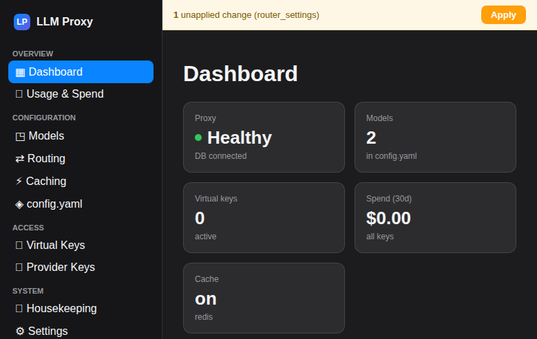
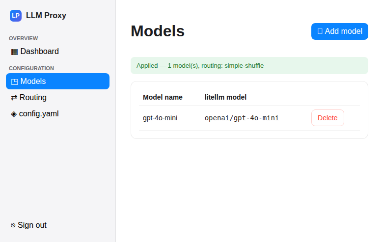
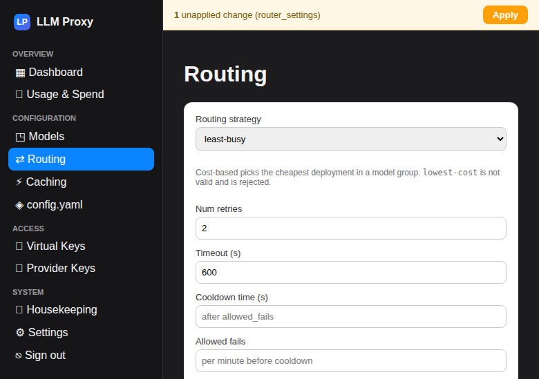
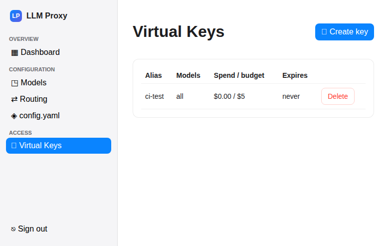
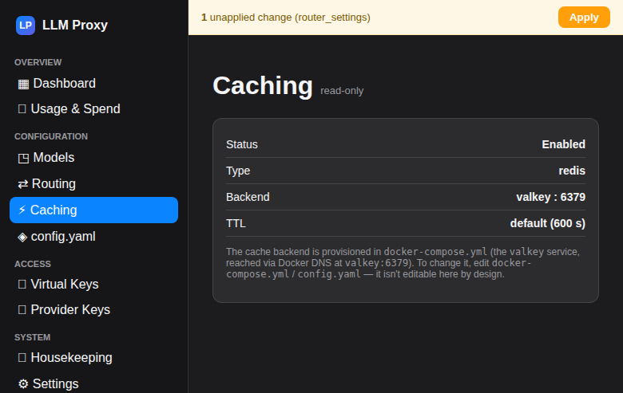
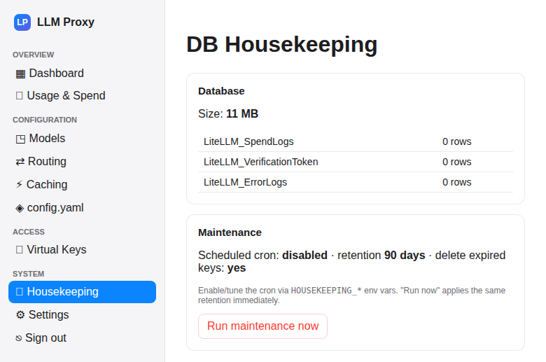
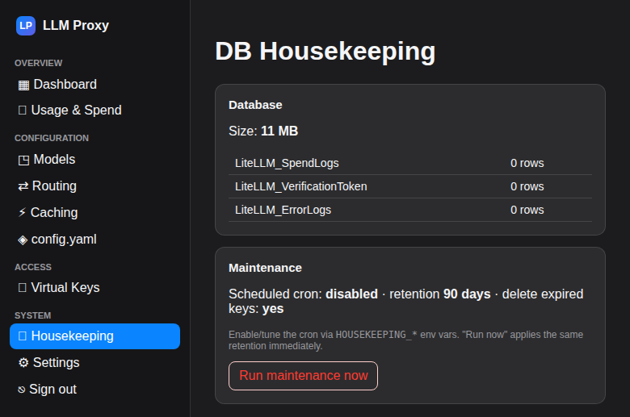

# LLM-Proxy

A self-hosted **[LiteLLM](https://github.com/BerriAI/litellm) gateway** (Docker
Compose) — LiteLLM proxy + Postgres + Valkey — with a **purpose-built, Apple-HIG
admin UI** that replaces LiteLLM's bundled UI. All proxy configuration lives in a
single, version-controlled `config.yaml` (config-only mode); the UI is a
validating editor for it, plus a friendly front-end over the proxy's API for
virtual keys, budgets, usage, and DB housekeeping.

> **Status: shipped.** The admin UI (`llm-proxy-ui`) is complete — Phases 1–5 plus
> **v2**: a staged **Save → Apply** workflow (one restart, baseline rollback), a KPI
> **Dashboard**, a **Provider Keys** vault, **Models v2** (test-connection / health /
> custom costs / credentials), and a **LiteLLM catalog sync** (auto-fill model
> pricing). Released via CI to GHCR. See **[`docs/admin-ui.md`](docs/admin-ui.md)**
> and the [v1](docs/superpowers/specs/2026-06-07-llm-proxy-ui-design.md) +
> [v2](docs/superpowers/specs/2026-06-07-llm-proxy-ui-v2-design.md) design specs.

## The admin UI



| | |
|---|---|
|  |  |
|  |  |
|  |  |

Dark mode included:



**Screens:** Dashboard (KPI cards) · Usage & Spend · Models (provider CRUD +
test/health/costs/credentials) · Provider Keys (encrypted vault) · Routing (strategy,
timeout/cooldown, fallbacks) · Caching (read-only status) · config.yaml viewer ·
Virtual Keys (create/budget/delete) · DB Housekeeping · Settings (export/import,
catalog sync, dark mode). Each screen's **Save** validates + atomically writes +
backs up its section (staged, no restart); the global **Apply** bar then restarts the
proxy **once**, verifies health & `/v1/models`, and **rolls back to the last-applied
baseline** on failure.

## Why a custom UI?

LiteLLM's bundled UI was unreliable on this stack, so the guardrails are designed in:

- It **never writes an `ssl` key** into `cache_params` → LiteLLM bug #10949 (SSL
  handshake hangs against plain Valkey) is impossible.
- `routing_strategy` is constrained to the valid enum (the bogus `lowest-cost` is
  rejected). Model/general secrets must be `os.environ/<VAR>` references — literal
  secrets there are rejected. The one exception is the **Provider Keys vault**
  (encrypted at rest, typed in the UI), which materializes into a `0600`,
  git-ignored `config.yaml` so keys survive the restart-based Apply.
- `config.yaml` is the **single source of truth** (`store_model_in_db: false`),
  so the effective config is never silently overridden by the DB.

## Stack

| Service | Image | Purpose |
|---|---|---|
| `litellm` | `ghcr.io/berriai/litellm:main-stable` | OpenAI-compatible gateway (config-only; bundled UI not used) |
| `llm-proxy-ui` | `ghcr.io/tekgnosis-net/llm-proxy-ui` | Apple-HIG admin UI (FastAPI + Svelte) |
| `postgres` | `postgres:16-alpine` | Virtual keys, budgets, spend logs |
| `valkey` | `valkey/valkey:8-alpine` | Response cache + rate-limit state (Redis-protocol, BSD-3 fork) |
| `socket-proxy` | `tecnativa/docker-socket-proxy` | Scoped Docker access so the UI can restart the proxy to apply config |

**Configuration model:** `config.yaml` is authoritative for models, routing, and
caching. Keys/budgets/spend are stateful and live in Postgres, managed via the
proxy API. See [`docs/config-schema.md`](docs/config-schema.md) for the full set
of config parameters the UI generates and validates.

## Quickstart

No build step — the images are pulled (the UI image is published publicly to GHCR).

```bash
# 1. configure secrets interactively — creates/updates .env with everything
#    docker-compose.yml needs (auto-generates keys, hashes + escapes the admin
#    password, etc.). Re-run any time to change values.
./setup_env_helper.sh

# 2. start the stack (pulls the published images)
docker compose up -d        # wait for (healthy)
```

Open the **admin UI** at `http://<host>:${UI_PORT:-8081}` and log in with your
password. Proxy health: `curl -fsS http://localhost:4000/health/readiness`.

> Prefer to set `.env` by hand? Copy `.env.example` to `.env` and fill it in —
> note the admin hash's `$` must be escaped as `$$` (the helper does this for you).
> The UI image is **pinned** to a release tag in `docker-compose.yml`; to update,
> bump that tag to a newer release (or switch it to `:latest` for auto-updates),
> then `docker compose pull && docker compose up -d`.

## Bind-mounted layout

```
.
├── docker-compose.yml
├── .env                 ← secrets (NOT in git)
├── config/config.yaml.example  ← secret-free bootstrap (committed; seeds config.yaml)
├── config/config.yaml   ← single source of truth (models/routing/cache + materialized provider keys) — UI-managed, git-ignored, mode 0600
├── ui/                  ← the custom admin UI (FastAPI + Svelte)
└── data/{postgres,valkey}/  ← persistent state
```

You can still hand-edit `config/config.yaml` and `docker compose restart litellm`
to apply (~25s; SIGHUP is a no-op on this image). Note: since v2 the file holds
**materialized provider-key secrets**, so it's written `root`-owned mode **`0600`**
and is **git-ignored** — the repo commits `config/config.yaml.example` (secret-free)
and the app seeds `config.yaml` from it on first run. Edit via the UI, or `sudo`.

## Secrets in `.env`

- **`LITELLM_MASTER_KEY`** — gates the proxy's admin API; the UI holds it
  **server-side only**, never sent to the browser. Safe to rotate.
- **`LITELLM_SALT_KEY`** — encrypts provider API keys in Postgres. **Do not
  rotate** after adding keys (makes them undecryptable). Back it up.
- **`ADMIN_PASSWORD_HASH`** (argon2), **`SESSION_SECRET`** — admin UI login +
  cookie signing. The hash's `$` must be escaped as `$$` in `.env` (see
  [`docs/admin-ui.md`](docs/admin-ui.md)). **`SESSION_SECRET` also derives the
  Provider Keys vault's encryption key — don't rotate it after saving keys**
  (makes them undecryptable), or set a dedicated `CREDENTIALS_KEY`.

`.env` is `.gitignore`d — share `.env.example` only.

## DB housekeeping (optional)

Set in `.env` to enable the scheduled maintenance cron (off by default):

```bash
HOUSEKEEPING_ENABLED=true
HOUSEKEEPING_INTERVAL_HOURS=24
HOUSEKEEPING_SPENDLOG_RETENTION_DAYS=90
```

The Housekeeping screen shows DB size/row counts and a manual "Run now" (trims
spend logs past retention + deletes expired keys; bounded + parameterized).

## Common operations

```bash
docker compose logs -f litellm                 # tail proxy logs
docker compose restart litellm                 # apply config.yaml changes (~25s)
docker compose down                            # stop (data persists in ./data)
docker compose exec postgres pg_dump -U "$POSTGRES_USER" litellm > backup-$(date +%F).sql
```

If Postgres shows permission errors on first boot:
`sudo chown -R 999:999 data/postgres data/valkey` then `docker compose up -d`.

## Documentation

- **[`docs/admin-ui.md`](docs/admin-ui.md)** — the admin UI (architecture, run, features).
- **[`docs/config-schema.md`](docs/config-schema.md)** — LiteLLM config.yaml parameter reference.
- **[`docs/superpowers/specs/`](docs/superpowers/specs/)** — design spec + clickable prototype.
- **[`docs/superpowers/plans/`](docs/superpowers/plans/)** — per-phase implementation plans.
- **[`docs/archive/`](docs/archive/)** — legacy guides for the bundled LiteLLM UI (concepts still valid).

## CI/CD

`main` runs **semantic-release** (conventional commits → versioned GitHub
releases) and publishes the UI image to GHCR
(`ghcr.io/tekgnosis-net/llm-proxy-ui:<version>` + `:latest`).

## Acknowledgements

This project is a deployment + admin UI built **on top of
[LiteLLM](https://github.com/BerriAI/litellm)** by [BerriAI](https://www.litellm.ai/) —
the open-source LLM gateway/proxy. All the heavy lifting (OpenAI-compatible
proxying, multi-provider routing, load balancing, fallbacks, response caching,
virtual-key management, budgets, and spend tracking) is powered by LiteLLM. This
repository adds a Docker Compose deployment and a purpose-built admin UI around
it. Huge thanks to the LiteLLM team and community. LiteLLM is MIT-licensed; see
their repository for details.

Also built with [FastAPI](https://fastapi.tiangolo.com/),
[Svelte](https://svelte.dev/), [PostgreSQL](https://www.postgresql.org/),
[Valkey](https://valkey.io/), and
[tecnativa/docker-socket-proxy](https://github.com/Tecnativa/docker-socket-proxy).
